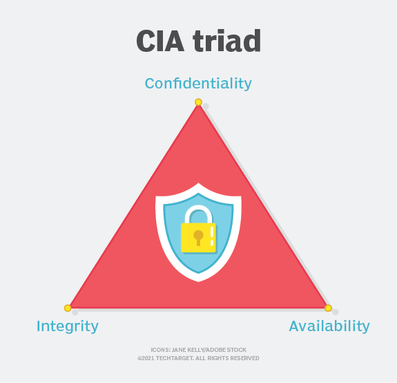
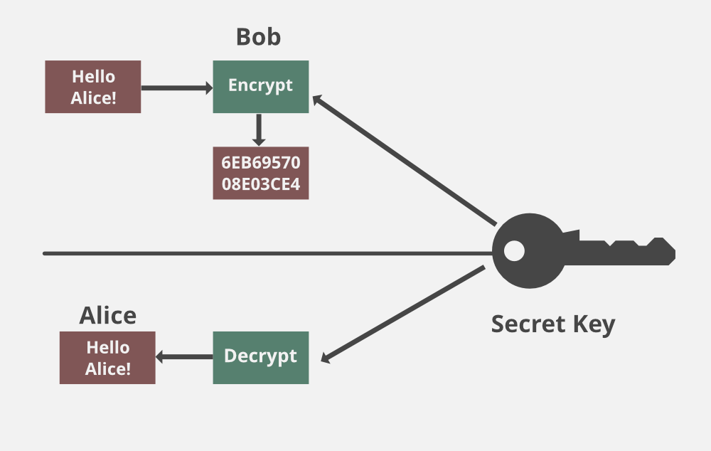
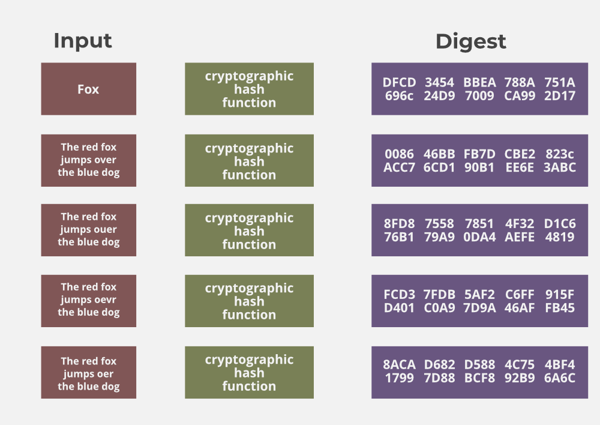
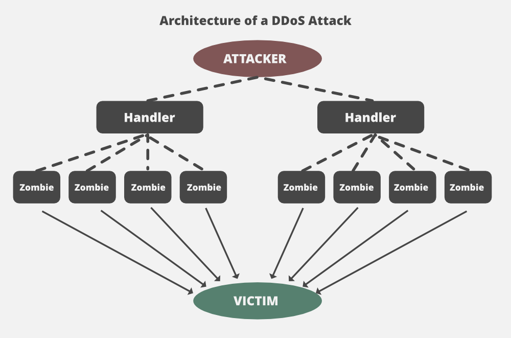
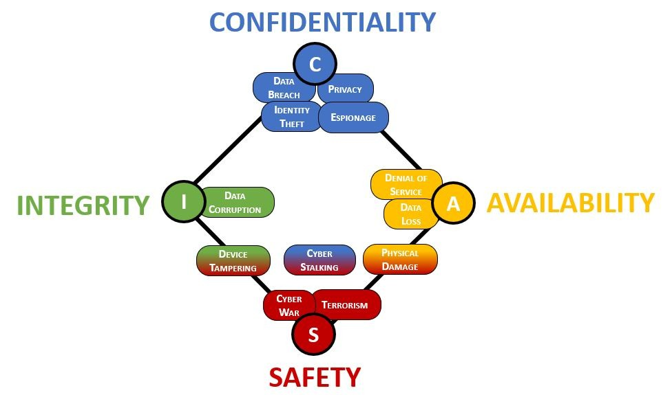

# Introduction to Cybersecurity

## What is cyber security?
**Definition:** The practice of protecting systems, networks, programs, devices, and data from digital attacks, damage, or unauthorized access. It involves technologies, processes, and controls designed to safeguard confidentiality, integrity, and availability of information.

# Cyber threats & attack types (Malware, Phishing, Ransomware, etc.)
Cyber threats are potential dangers or malicious acts that aim to disrupt, damage, steal, or gain unauthorized access to computer systems, networks, or data. Attack types are the specific methods used to carry out these threats.
*   **Malware (Malicious Software):** Software designed to harm or exploit systems (e.g., viruses, worms, trojans, spyware).
*   **Phishing:** Deceptive attempts (usually via email, SMS, or fake websites) to trick individuals into revealing sensitive information (credentials, financial details).
*   **Ransomware:** Malware that encrypts a victim's files or locks their system, demanding payment (ransom) for restoration.

## Timeline of Major Cyber Attacks (Chronological Order):

### Early Days (1980s - 1990s):

- **1988: Morris Worm:** One of the earliest significant computer worms, it affected about 10% of the roughly 60,000 computers connected to the internet at the time, causing significant disruption.
- **1999: Melissa Virus:** A mass-mailing macro virus that spread via email attachments, it was one of the first widely known email-borne viruses.
- **1999: NASA Hack:** A 15-year-old hacker gained access to NASA's Marshall Space Flight Center computers, installing a backdoor and accessing sensitive data.

### The 2000s: Rise of Financially Motivated Attacks:

- **2000: ILOVEYOU Worm:** A highly infectious email worm that spread rapidly, causing billions of dollars in damage worldwide.
- **2003: SQL Slammer Worm:** A fast-spreading computer worm that significantly slowed down internet traffic.
- **2007: Estonia Cyberattack:** A series of coordinated cyberattacks targeting Estonian government, financial, and media websites, attributed to state-sponsored actors.
- **2008: Conficker Worm:** A sophisticated worm that infected millions of computers globally, including critical infrastructure, exploiting Windows vulnerabilities.

### The 2010s: Organized Cybercrime and Advanced Persistent Threats (APTs):

- **2010: Stuxnet Worm:** A highly sophisticated worm believed to be a joint US-Israeli operation, targeting Iranian nuclear facilities and marking the first known instance of cyber warfare causing physical damage.
- **2011: RSA Security Breach:** Hackers used phishing emails to compromise RSA's SecurID two-factor authentication system, impacting numerous high-profile clients.
- **2013-2016: Yahoo! Data Breaches:** Several massive data breaches compromised billions of Yahoo! user accounts, exposing personal information. This remains one of the largest data breaches in history.
- **2014: Sony Pictures Entertainment Hack:** A destructive cyberattack attributed to North Korea in retaliation for "The Interview" film, leading to the leak of sensitive employee data, emails, and unreleased films.
- **2015: Ukraine Power Grid Attack:** Hackers believed to be Russian gained access to Ukraine's power grid, causing widespread blackouts, a landmark incident demonstrating the potential impact of cyberattacks on critical infrastructure.
- **2016: Democratic National Committee (DNC) Hack:** Emails from the DNC were leaked during the US presidential election, attributed to Russian state-sponsored hackers.
- **2017: WannaCry Ransomware Attack:** A global ransomware attack that exploited a Windows vulnerability, encrypting data on hundreds of thousands of computers across over 150 countries and demanding ransom payments.
- **2017: NotPetya/ExPetr Ransomware Attack:** Another significant ransomware attack, initially targeting Ukraine but quickly spreading globally, causing extensive damage to businesses.
- **2017: Equifax Data Breach:** A breach that exposed the personal information of nearly 150 million Americans, including Social Security numbers and credit card details.

### The 2020s (Up to April 2025): Escalation of Ransomware and Geopolitical Attacks:

- **2020: SolarWinds Supply Chain Attack:** A sophisticated attack where malicious code was inserted into SolarWinds' Orion software, potentially compromising thousands of organizations, including US government agencies and major corporations.
- **2020: Google DDoS Attack:** Google reported mitigating a record-breaking UDP amplification DDoS attack peaking at 2.5 Tbps, originating from Chinese ISPs.
- **2021: Microsoft Exchange Server Attacks:** Exploitation of zero-day vulnerabilities in Microsoft Exchange servers affected tens of thousands of organizations globally.
- **2021: Colonial Pipeline Ransomware Attack:** A major ransomware attack that disrupted a critical fuel pipeline in the United States, leading to fuel shortages and highlighting the vulnerability of critical infrastructure.
- **2023: MOVEit Transfer Vulnerability Exploitation:** A widespread campaign exploiting a vulnerability in the MOVEit file transfer software, impacting numerous organizations worldwide, including government agencies and large corporations.
- **January 2024: Orbit Chain Hack:** A blockchain platform lost $86 million in cryptocurrency due to a sophisticated attack believed to be state-sponsored.
- **January 2024: KyivStar Telecommunication Attack:** Russian hackers reportedly wiped thousands of systems at Ukraine's largest telecommunications provider, causing widespread service outages.
- **February 2024: AT&T Data Breach:** AT&T confirmed a data breach affecting approximately 73 million current and former customers, with data from 2019 or earlier being leaked.
- **July 2024: CrowdStrike-Microsoft Outage:** A faulty software update by CrowdStrike caused a global IT outage, impacting airlines and hospitals.
- **November 2024: Salt Typhoon Attacks:** Chinese hackers were reported to have breached at least eight US telecommunications providers and others globally for espionage.
- **December 2024: Cyberattacks on Indian Government Entities:** A significant increase in cyberattacks targeting Indian government entities was reported.
- **January 2025: Increase in Russian Cyberattacks on Ukraine:** A surge in Russian cyberattacks targeting Ukraine's critical infrastructure was reported.
- **February 2025: Meta (WhatsApp) Spyware Hack:** Meta confirmed a sophisticated spyware attack targeting WhatsApp users, including journalists and civil society members.
- **February 2025: IoT Data Breach (Mars Hydro):** A massive data breach exposed 2.7 billion records through an unsecured database belonging to a Chinese IoT company.
- **April 2025: Ransomware Attacks on European Entities:** Several ransomware attacks affected organizations in France, Switzerland, and Belgium.
- **April 2025: Hacking of Social Media Account of a British Politician:** A Minister's X (formerly Twitter) account was hacked to promote a crypto scam.

## Cybersecurity guidelines

**I. Foundational Security Practices:**

* **Strong Passwords & Multi-Factor Authentication (MFA):** Use complex, unique passwords and enable MFA wherever possible for enhanced account security.
* **Software Updates:** Regularly update operating systems, applications, and firmware to patch vulnerabilities.
* **Antivirus & Anti-Malware:** Install and maintain reputable security software to detect and remove malicious threats.
* **Firewall Activation:** Enable and properly configure firewalls on devices and networks to control incoming and outgoing traffic.
* **Data Backup & Recovery:** Regularly back up critical data and have a tested recovery plan in case of data loss or ransomware.

**II. Secure Online Behavior:**

* **Be Wary of Phishing:** Recognize and avoid suspicious emails, links, and attachments that may attempt to steal information.
* **Secure Browsing:** Use HTTPS for secure connections and be cautious about the websites you visit.
* **Limit Information Sharing:** Be mindful of the personal information you share online and on social media.
* **Secure Wi-Fi:** Use strong passwords for your Wi-Fi network and avoid connecting to unsecured public Wi-Fi for sensitive tasks.

**III. Data Protection & Privacy:**

* **Data Encryption:** Encrypt sensitive data at rest and in transit to protect it from unauthorized access.
* **Access Control:** Implement the principle of least privilege, granting users only the necessary access to resources.
* **Privacy Settings:** Configure privacy settings on applications and online services to control your data.
* **Data Disposal:** Securely erase or destroy old storage devices to prevent data leaks.

**IV. Organizational Security (for businesses/institutions):**

* **Security Awareness Training:** Educate employees about cybersecurity threats and best practices.
* **Incident Response Plan:** Develop and regularly test a plan to handle security incidents effectively.
* **Vulnerability Management:** Regularly scan for and remediate security vulnerabilities in systems and applications.
* **Network Segmentation:** Divide the network into isolated segments to limit the impact of a security breach.
* **Regular Security Audits:** Conduct periodic security assessments to identify weaknesses and improve security posture.

**V. Emerging Threats Awareness:**

* **Stay Informed:** Keep up-to-date on the latest cybersecurity threats, such as ransomware, phishing techniques, and zero-day exploits.
* **Adapt Security Measures:** Adjust security practices to address new and evolving threats.

These notes provide a concise overview of fundamental cybersecurity guidelines. Implementing these practices significantly reduces the risk of falling victim to cyberattacks.

# CIA Triad: Confidentiality, Integrity, Availability

A foundational model in information security used to guide policies and strategies.

## Confidentiality
Ensuring that information is not disclosed to unauthorized individuals, entities, or processes (keeping secrets secret). Achieved through encryption, access controls, authentication.

Confidentiality means that only authorized individuals/systems can view sensitive or classified information. The data being sent over the network should not be accessed by unauthorized individuals. The attacker may try to capture the data using different tools available on the Internet and gain access to your information. A primary way to avoid this is to use encryption techniques to safeguard your data so that even if the attacker gains access to your data, he/she will not be able to decrypt it. Encryption standards include AES(Advanced Encryption Standard) and DES (Data Encryption Standard). Another way to protect your data is through a VPN tunnel. VPN stands for Virtual Private Network and helps the data to move securely over the network.

## Integrity
Maintaining the accuracy, consistency, and trustworthiness of data over its entire lifecycle; preventing unauthorized modification or deletion. Achieved through hashing, digital signatures, version control, backups.

The next thing to talk about is integrity. Well, the idea here is to make sure that data has not been modified. Corruption of data is a failure to maintain data integrity. To check if our data has been modified or not, we make use of a hash function. 
We have two common types: SHA (Secure Hash Algorithm) and MD5(Message Direct 5). Now MD5 is a 128-bit hash and SHA is a 160-bit hash if we’re using SHA-1. There are also other SHA methods that we could use like SHA-0, SHA-2, and SHA-3. 

Let’s assume Host ‘A’ wants to send data to Host ‘B’ to maintain integrity. A hash function will run over the data and produce an arbitrary hash value H1 which is then attached to the data. When Host ‘B’ receives the packet, it runs the same hash function over the data which gives a hash value of H2. Now, if H1 = H2, this means that the data’s integrity has been maintained and the contents were not modified. 

## Availability
Ensuring that systems and data are accessible and usable upon demand by authorized users. Achieved through redundancy, backups, disaster recovery plans, DDoS mitigation.

This means that the network should be readily available to its users. This applies to systems and to data. To ensure availability, the network administrator should maintain hardware, make regular upgrades, have a plan for fail-over, and prevent bottlenecks in a network. Attacks such as DoS or DDoS may render a network unavailable as the resources of the network get exhausted. The impact may be significant to the companies and users who rely on the network as a business tool. Thus, proper measures should be taken to prevent such attacks. 

## CIA Risk and Controls

| CIA Triad Element | Common Risks | Example Controls |
|-------------------|--------------------------------------------------|-------------------------------------------------------------|
| **Confidentiality** | Unauthorized access, data breaches, eavesdropping, social engineering, insider threats, weak access controls | Encryption, access control lists (ACLs), strong authentication, data loss prevention (DLP), security awareness training, need-to-know principle |
| **Integrity** | Unauthorized modification, data corruption, system errors, malicious software, insider threats, lack of version control | Hashing, digital signatures, version control systems, audit trails, intrusion detection systems (IDS), change management processes, regular backups |
| **Availability** | Denial-of-service (DoS) attacks, hardware failures, software bugs, natural disasters, power outages, lack of redundancy | Redundancy (servers, power, network), backups and disaster recovery plans, load balancing, failover mechanisms, surge protectors, uninterruptible power supplies (UPS) |

## Benefits of the CIA triad

Despite its challenges, the CIA triad is widely used because of the many benefits that it may provide. The following are several of the benefits that organizations may realize when using the CIA triad to guide their security programs:

* Data security and privacy—helps protect against unauthorized access, theft, or manipulation of data.
* Compliance—ensures that organizations follow regulations and legal frameworks that protect sensitive information.
* Proactive risk prevention—facilitates the identification and mitigation of vulnerabilities to close security gaps and prevent cyber attacks.
* Accessibility—maintains the availability of systems and data as well as assures their quality by preventing unauthorized access.
* Security profile—optimizes organizations’ cybersecurity postures to enhance overall security.
* Employee training—provides a guideline to ensure that cybersecurity training programs are comprehensive and effective.

## Standards that reference the CIA triad

As a lynchpin of the information security ecosystem, the CIA triad elements are referenced in a number of standards, including the following:

*   **ISO 27001**

    In its description of the ISO 27001 standard, ISO lists “data integrity, confidentiality, and availability” as one of its primary benefits. It states that ISO 27001 will help organizations “ensure that assets such as financial statements, intellectual property, employee data, and information entrusted by third parties remain undamaged, confidential, and available as needed.”

*   **GDPR**

    The European Union’s General Data Protection Regulation (GDPR), one of the toughest privacy and security laws in the world, mentions the cornerstones of the CIA triad in Article 32 (i.e., “ensure the ongoing confidentiality, integrity, availability, and resilience of processing systems and services”).
    
    
*   **PCI-DSS**

    The Payment Card Industry Data Security Standard (PCI DSS) refers to confidentiality and integrity explicitly throughout the standard with specific references under Requirement 3 (“protect stored account data”) and Requirement 7 (“restrict access to system components and cardholder data”). Availability is implied through measures like maintaining secure systems (Requirement 6) and ensuring continuous monitoring and access control (Requirements 10 and 11).
    
*   **NIST SP 800-53**

    NIST SP 800-53 (Security and Privacy Controls for Information Systems and Organizations) references the components of the CIA triad throughout the standard. Confidentiality is referenced in Section 3.3.4 (Security and Privacy Controls for Information Confidentiality), integrity in Section 3.3.3 (Security and Privacy Controls for Information Integrity), and availability in Section 3.3.2 (Security and Privacy Controls for Information Availability).

## The "CIA Triad" Is Insufficient In The Age of AI/OT/IoT

With the rise of Artificial Intelligence (AI) and autonomous technologies, the traditional Confidentiality, Integrity & Availability "CIA Triad" further demonstrates its insufficiency due to its avoidance of a safety component for cybersecurity practices. The CIA Triad does not adequately represent a digital world with embedded technologies (e.g., Internet of Things (IoT) and Operational Technology (OT)) and AI-powered capabilities.

It has been 6 years since ComplianceForge replaced references to the CIA Triad with a new model, the Confidentiality, Integrity, Availability & Safety (CIAS). Even back in 2017, before the rise in Artificial Intelligence (AI) and autonomous technologies, it was clear that digital security needed to have a safety component to guide risk management decisions.

**Defense in Depth**

A core cybersecurity strategy employing multiple, overlapping layers of security controls throughout an IT infrastructure.
    
*   **Core Idea:** If one security layer fails or is bypassed, other layers remain to protect assets or detect the intrusion. Avoids reliance on a single point of failure.
*   **Key Principles:**
    *   **Layered Security:** Uses a series of different security measures, not just one (e.g., not just a perimeter firewall).
    *   **Redundancy:** Assumes no single control is perfect and anticipates potential failures.
*   **Control Types (Layers):** Typically includes a combination of:
    *   **Physical Controls:** Locks, security guards, secure server room access.
    *   **Technical Controls:** Firewalls, IDS/IPS, encryption, anti-malware, Multi-Factor Authentication (MFA), Access Control Lists (ACLs).
    *   **Administrative Controls:** Security policies, procedures, user awareness training, background checks, incident response plans, disaster recovery plans.
*   **Goal:** To increase attacker difficulty, provide more detection/response opportunities, and minimize the impact of any single layer breach.
*   **Analogy:** Like defending a medieval castle with multiple obstacles (moat, outer wall, inner wall, guards, keep).

