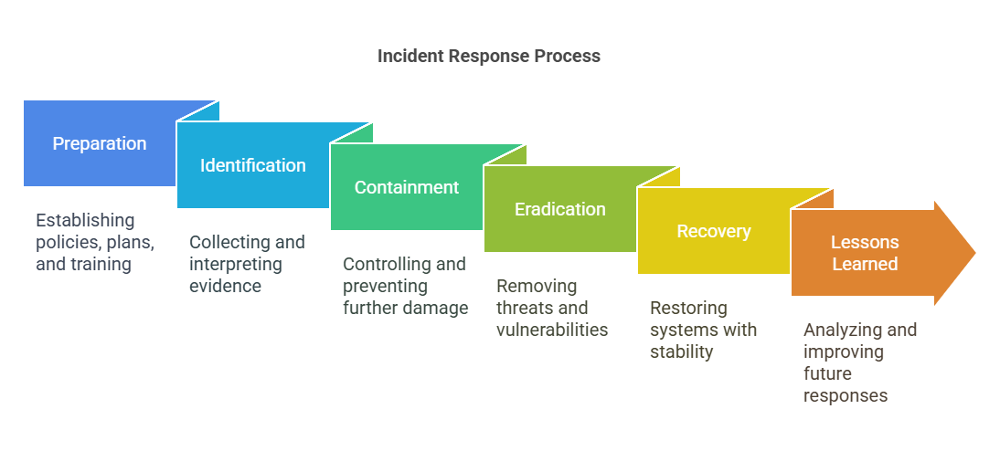
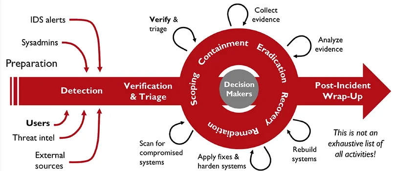

# Incident Response & Digital Forensics

**Incident Response (IR)** refers to the organized approach an organization takes to prepare for, detect, contain, eradicate, and recover from a suspected cybersecurity breach or incident. The goal is to minimize damage, reduce recovery time and costs, and prevent future incidents.

**Digital Forensics (DF)** is the process of identifying, preserving, collecting, analyzing, and reporting on digital evidence found on computers, networks, and other storage devices. It's often a crucial part of incident response, helping to understand what happened, how it happened, and who might be responsible.

## Cyberattack response process

The incident response process is often cyclical and follows a structured methodology. A common model is the PICERL lifecycle:

1.  **Preparation:**
    *   Developing an Incident Response Plan (IRP).
    *   Establishing an Incident Response Team (IRT) with defined roles and responsibilities.
    *   Acquiring necessary tools (hardware/software for forensics, communication, etc.).
    *   Conducting training and awareness programs.
    *   Implementing preventative security controls (firewalls, IDS/IPS, EDR, backups).

2.  **Identification:**
    *   Detecting deviations from normal operations.
    *   Monitoring alerts from security tools (SIEM, IDS/IPS, AV, EDR).
    *   Receiving reports from users or external parties.
    *   Validating whether an event is actually a security incident.
    *   Initial assessment of the incident's scope and impact.

3.  **Containment:**
    *   Limiting the damage and preventing further spread.
    *   Short-term containment: Isolating affected systems from the network.
    *   Long-term containment: Rebuilding clean systems to replace compromised ones.
    *   Strategizing based on the type of attack and affected systems.

4.  **Eradication:**
    *   Removing the root cause of the incident (e.g., malware, vulnerabilities, compromised accounts).
    *   Ensuring the attacker no longer has access.
    *   May involve patching, system hardening, removing malicious files, resetting credentials.

5.  **Recovery:**
    *   Restoring affected systems and services to normal operation.
    *   Validating that systems are clean and functioning correctly.
    *   Monitoring closely for any signs of recurring activity.
    *   Prioritizing critical systems for restoration.

6.  **Lessons Learned (Post-Incident Activity):**
    *   Conducting a post-mortem analysis within a specific timeframe (e.g., two weeks).
    *   Documenting the incident: what happened, how it was handled, what worked well, what didn't.
    *   Identifying areas for improvement in security controls, policies, and the IR plan itself.
    *   Updating the IRP based on findings.

### Rethinking Incident Response: From PICERL to DAIR

While PICERL is a widely recognized standard, some modern approaches, like the **DAIR (Detection, Analysis, Incident Response)** model, emphasize a more integrated and continuous flow, particularly relevant in cloud-native or highly dynamic environments. DAIR often streamlines the process:

1.  **Detection:**
    *   Focuses on identifying potential threats and anomalies as early as possible using advanced monitoring, threat intelligence, and behavioral analysis.
    *   Emphasizes proactive threat hunting.

2.  **Analysis:**
    *   Involves rapidly assessing the nature, scope, and impact of the detected threat.
    *   Combines elements of PICERL's Identification and Containment phases, focusing on understanding the "what" and "how" quickly.
    *   Often leverages automation and orchestration for faster triage.

3.  **Incident Response:**
    *   Encompasses the actions taken to contain, eradicate, and recover from the incident, similar to the latter stages of PICERL.
    *   Includes post-incident analysis (Lessons Learned) to feed back into the Detection phase, creating a tighter feedback loop.

## Basics of forensic investigations

Digital forensic investigations follow a rigorous process to ensure evidence is admissible and the findings are accurate. Key phases include:

1.  **Identification:**
    *   Recognizing potential sources of digital evidence (computers, mobile devices, servers, logs, cloud storage).
    *   Understanding the scope of the investigation based on the incident.

2.  **Preservation:**
    *   Protecting the integrity of the original evidence.
    *   Establishing and documenting the Chain of Custody (who handled the evidence, when, where, and why).
    *   Preventing alteration or destruction of data (e.g., using write-blockers).

3.  **Collection:**
    *   Acquiring digital evidence in a forensically sound manner.
    *   Creating bit-for-bit copies (forensic images) of storage media.
    *   Collecting volatile data (like RAM contents) first, if possible and relevant.
    *   Documenting every step of the collection process.

4.  **Examination:**
    *   Using specialized forensic tools and techniques to uncover relevant data.
    *   Bypassing or mitigating operating system features that might obscure data.
    *   Identifying hidden, deleted, or encrypted data.
    *   Focusing on data relevant to the investigation questions.

5.  **Analysis:**
    *   Interpreting the examined data to draw conclusions.
    *   Correlating information from multiple sources.
    *   Establishing timelines of events (e.g., using file timestamps, logs).
    *   Answering the "who, what, when, where, why, and how" questions related to the incident.

6.  **Reporting:**
    *   Documenting the findings of the investigation clearly and concisely.
    *   Detailing the methods and tools used.
    *   Presenting the evidence and the conclusions drawn from it.
    *   Ensuring the report is understandable to the intended audience (technical staff, management, legal counsel).

### Hands-on Forensic Investigation Techniques

Practical forensics involves examining specific artifacts and using specialized tools depending on the operating system.

#### Windows Forensics

*   **Key Artifacts:**
    *   **Event Logs:** Security (4624-Logon, 4634-Logoff, 4688-Process Creation), System, Application logs found in `C:\Windows\System32\winevt\Logs\`.
        *   **Common Windows Event Log Types:**
            | Log Name        | Default Location (`%SystemRoot%\System32\winevt\Logs\`) | Description                                                                                                | Key Forensic Info                                                                                                                               |
            | --------------- | ------------------------------------------------------- | ---------------------------------------------------------------------------------------------------------- | ----------------------------------------------------------------------------------------------------------------------------------------------- |
            | **Security**    | `Security.evtx`                                         | Records security-related events based on audit policy settings.                                            | Logon/logoff activity (Success/Failure), account management, object access, process creation (if enabled), policy changes.                      |
            | **System**      | `System.evtx`                                           | Records events logged by Windows system components.                                                        | Device driver issues, system service start/stop events, hardware failures, system startup/shutdown times.                                       |
            | **Application** | `Application.evtx`                                      | Records events logged by applications or programs.                                                         | Application errors, crashes, informational events specific to installed software (e.g., database logs, antivirus detections).                 |
            | **Setup**       | `Setup.evtx`                                            | Records events related to application setup and Windows updates/patches.                                   | Installation/uninstallation of software, Windows updates, system configuration changes during setup.                                          |
            | **ForwardedEvents** | `ForwardedEvents.evtx`                                | Stores events collected from remote computers (if Windows Event Forwarding is configured).                 | Centralized logging point for events from other systems in the network.                                                                         |
            | **PowerShell**  | `Microsoft-Windows-PowerShell%4Operational.evtx`        | Records PowerShell activity (module logging, script block logging - requires specific GPO enablement).       | Executed PowerShell commands, scripts, potential malicious activity using PowerShell.                                                           |
            | **Sysmon**      | `Microsoft-Windows-Sysmon%4Operational.evtx`            | Records detailed system activity (requires Sysmon installation/configuration).                             | Process creation with hashes/command lines, network connections, file creation times, registry modifications, driver loading, WMI events, etc. |
        *   **`wevtutil.exe`:** A crucial built-in command-line utility for managing and querying Windows Event Logs.
            *   **Query Events (`qe`):** Search/retrieve events based on time, ID, level, provider, keywords, or XPath. *Example: `wevtutil qe Security /q:"*[System[(EventID=4624)]]" /rd:true /c:5`*
            *   **Export Logs (`epl`):** Export logs (entire or queried) to `.evtx`, XML, or text files for offline analysis/archiving. *Example: `wevtutil epl Security C:\temp\SecurityLogBackup.evtx`*
            *   **List Logs (`el`):** Show all available logs.
            *   **Get Log Info (`gl`):** Display configuration details (size, retention, etc.).
            *   **Set Log Info (`sl`):** Modify log configuration (requires admin).
            *   **Clear Logs (`cl`):** Erase events from a log (requires admin, use with caution, often after backup).
            *   **List Publishers (`ep`):** Show event providers.
            *   **Get Publisher Metadata (`gp`):** Display details about a specific provider.
            *   **Forensic/IR Use:** Essential for collecting log evidence (`.evtx`), targeted filtering for IOCs, and automating log collection/analysis.
        *   **Key Windows Event IDs (Examples):**
            *   **Logon/Logoff & Account Usage:**
                *   `4624`: Successful logon (Logon Type field is crucial: 2=Interactive, 3=Network, 4=Batch, 5=Service, 7=Unlock, 10=RemoteInteractive/RDP, 11=CachedInteractive).
                *   `4625`: Failed logon.
                *   `4634`: User logoff.
                *   `4648`: Logon attempt using explicit credentials (e.g., RunAs).
                *   `4720`: User account created.
                *   `4722`: User account enabled.
                *   `4725`: User account disabled.
                *   `4726`: User account deleted.
                *   `4732`: User added to a privileged group (e.g., Administrators).
                *   `4740`: User account locked out.
            *   **Process & Service Activity:**
                *   `4688`: Process created (requires specific audit policy enablement; includes command line).
                *   `4697`: Service installed.
                *   `7045`: Service installed (System Log).
            *   **System Events:**
                *   `1102`: Audit log cleared (Security Log).
                *   `6005`: Event log service started (System Log - indicates system boot).
                *   `6006`: Event log service stopped (System Log - indicates system shutdown).
    *   **Registry:** Hives like SAM, SECURITY, SOFTWARE, SYSTEM (`C:\Windows\System32\config\`) and user-specific NTUSER.DAT (`C:\Users\<username>\`) contain vast information about system configuration, user activity, program execution, and connected devices.
    *   **File System Artifacts:**
        *   `$MFT` (Master File Table): Contains metadata for all files on an NTFS volume.
        *   Prefetch (`.pf` files in `C:\Windows\Prefetch\`): Evidence of program execution.
        *   Shimcache (Amcache.hve): Tracks application compatibility information, indicating execution.
        *   UserAssist Keys (Registry): Encoded data about GUI programs launched by a user.
        *   LNK Files (Shortcuts): Contain metadata about accessed files/folders, including original path and timestamps.
        *   Jump Lists: Track recently accessed files and applications.
        *   Shellbags (Registry): Track user window/folder viewing preferences and history.
        *   Recycle Bin (`$Recycle.Bin`): Contains deleted files and metadata.
    *   **Memory:** RAM dumps (`.dmp`), hibernation file (`hiberfil.sys`), page file (`pagefile.sys`) can contain running processes, network connections, passwords, encryption keys, and injected code.
    *   **Browser Artifacts:** History, cache, cookies, download lists (locations vary by browser).
    *   **Volume Shadow Copies (VSS):** Snapshots of volumes that may contain older versions of files or deleted data.
*   **Common Tools:**
    *   **Imaging:** FTK Imager, EnCase Imager, Guymager (Linux-based).
    *   **Analysis Suites:** Autopsy, EnCase Forensic, Magnet AXIOM, X-Ways Forensics.
    *   **Memory Analysis:** Volatility Framework, Rekall.
    *   **Registry Analysis:** Registry Explorer, RegRipper.
    *   **Artifact Parsing:** Eric Zimmerman's Tools (EZ Tools), KAPE.
    *   **Live Analysis:** Sysinternals Suite (Process Explorer, Autoruns, TCPView), Kansa (PowerShell-based).
    *   **Other Built-in CLI Tools:**
        *   `reg.exe`: Query, modify, export/import Registry keys/values.
        *   `fsutil.exe`: Query file system information (MFT, USN Journal, volumes).
        *   `netsh.exe`: View/manage network configuration (firewall rules, WLAN profiles).
        *   `schtasks.exe`: View/manage scheduled tasks (often used for persistence).
        *   `tasklist.exe`: List running processes and associated services.
        *   `netstat.exe`: Display network connections, listening ports, routing table (`-ano` is key).
        *   `driverquery.exe`: List installed device drivers.
        *   `systeminfo.exe`: Display system configuration summary (OS version, hotfixes, boot time).
        *   `wmic.exe`: Query system information via WMI (processes, services, startup items, patches, users - being deprecated but still useful).
        *   **PowerShell Cmdlets:** Extensive capabilities (`Get-EventLog`, `Get-Process`, `Get-Service`, `Get-NetTCPConnection`, `Get-ItemProperty`, `Select-String`, etc.).

#### Linux Forensics

*   **Key Artifacts:**
    *   **Log Files:** Central logs in `/var/log/` (e.g., `syslog`, `auth.log`/`secure`, `kern.log`, `messages`, `lastlog`, `faillog`, application-specific logs like `apache2/access.log`). `journalctl` for systemd journals.
        *   **Common Linux Log Files:**
            | Log File Name(s)        | Typical Location(s)                     | Description / Forensic Relevance                                                                                                |
            | ----------------------- | --------------------------------------- | ------------------------------------------------------------------------------------------------------------------------------- |
            | `syslog` / `messages`   | `/var/log/syslog` or `/var/log/messages`| General system activity logs, service start/stop, errors. Central point for many logs.                                          |
            | `auth.log` / `secure`   | `/var/log/auth.log` or `/var/log/secure`| Authentication events: successful/failed logins (SSH, console, sudo), user additions/removals. Crucial for tracking access. |
            | `kern.log`              | `/var/log/kern.log`                     | Kernel-level messages, hardware events, driver information. Can indicate hardware issues or module loading (e.g., rootkits).   |
            | `dmesg`                 | `/var/log/dmesg` (or `dmesg` command)   | Kernel ring buffer messages, especially useful for boot-time hardware detection and errors.                                     |
            | `boot.log`              | `/var/log/boot.log`                     | System boot process messages (may vary by distribution).                                                                        |
            | `lastlog`               | `/var/log/lastlog` (binary, use `lastlog` cmd) | Records the last login time/location for each user.                                                                             |
            | `faillog`               | `/var/log/faillog` (binary, use `faillog` cmd) | Records failed login attempts per user.                                                                                         |
            | `wtmp` / `utmp`         | `/var/log/wtmp`, `/var/run/utmp` (binary) | Records historical (`wtmp`) and current (`utmp`) user logins/logouts. Use `last`, `who` commands to view.                     |
            | `auditd` logs           | `/var/log/audit/audit.log`              | Detailed system call auditing (if `auditd` service is configured/running). Very verbose, tracks file access, commands, etc. |
            | Web Server Logs         | e.g., `/var/log/apache2/`, `/var/log/nginx/` | `access.log` (visitor IPs, requested URLs, user agents), `error.log` (server errors). Vital for web attack investigations. |
            | Package Manager Logs    | e.g., `/var/log/apt/history.log`, `/var/log/yum.log` | Records software installation, removal, and updates. Can show installation of malicious tools.                                |
            | Cron Logs               | `/var/log/cron` or within `syslog`/`messages` | Records execution of scheduled tasks (`cron` jobs).                                                                             |
    *   **Shell History:** User command history (e.g., `~/.bash_history`, `~/.zsh_history`). Check `HISTFILE` environment variable.
    *   **Log Rotation (`logrotate`):**
        *   **Purpose:** Utility that automatically manages log files (rotates, compresses, mails, deletes) to prevent them from consuming excessive disk space.
        *   **Configuration:** Primarily configured via `/etc/logrotate.conf` and specific configurations in `/etc/logrotate.d/`.
            *   `/etc/logrotate.conf`: Contains default settings.
            *   `/etc/logrotate.d/`: Directory containing configuration files for specific services/applications (e.g., `apache2`, `mysql-server`, `syslog`). This allows package maintainers to easily add log rotation rules for their software.
        *   **Common Directives & Usage:** Inside configuration files, you'll often see directives like:
            *   `daily`, `weekly`, `monthly`: Frequency of rotation.
            *   `rotate <count>`: Number of old log files to keep.
            *   `compress`/`nocompress`: Whether to compress rotated logs (usually with gzip). `delaycompress` compresses the log on the *next* rotation cycle.
            *   `missingok`: Don't issue an error if the log file is missing.
            *   `notifempty`: Don't rotate the log file if it's empty.
            *   `create <mode> <owner> <group>`: Create a new empty log file with specified permissions after rotation.
            *   `postrotate`/`endscript`: Commands to run after the log file is rotated (e.g., restarting a service to make it use the new log file).
        *   **Forensic Relevance:** Explains why older logs might be found in compressed formats (e.g., `syslog.1.gz`, `auth.log.2.gz`) or might be missing entirely if rotation includes deletion (`rotate 0`). Configuration files show the intended retention policy and potential actions taken during rotation. Attackers might tamper with these configurations to hide activity or disrupt logging.
    *   **User & Group Info:** `/etc/passwd`, `/etc/shadow`, `/etc/group`.
    *   **System Configuration:** Network settings (`/etc/network/interfaces`, `ip a`, `ss -tulpn`), running services (`systemctl list-units --type=service`), scheduled tasks (`/etc/cron.*`, `/var/spool/cron/crontabs`, `at` jobs).
    *   **File System Metadata:** Inodes contain timestamps (access, modify, change - MAC times), permissions, owner/group. Use `stat` command. Check for unusual SUID/SGID files (`find / -type f \( -perm -4000 -o -perm -2000 \) -ls`).
    *   **Process Information:** `/proc/` directory (live system) contains information about running processes, open files (`lsof`), network connections.
    *   **Memory:** RAM dump acquired using tools like LiME (Linux Memory Extractor).
    *   **Deleted Files:** Recovery depends heavily on the filesystem (ext3/4, XFS, Btrfs). Often relies on file carving or journal analysis. Less straightforward than NTFS.
    *   **Package Management Logs:** Logs related to installed/removed packages (e.g., `/var/log/apt/history.log` on Debian/Ubuntu, `/var/log/yum.log` or `/var/log/dnf.log` on RHEL/CentOS/Fedora).
*   **Common Tools:**
    *   **Imaging:** `dd`, `dcfldd`, `dc3dd`, Guymager.
    *   **Analysis Suites:** Autopsy (using The Sleuth Kit backend).
    *   **Memory Analysis:** Volatility Framework, Rekall.
    *   **Timeline Generation:** `log2timeline` (Plaso).
    *   **Command-Line Tools:**
        *   Filesystem: `tsk_` tools (from The Sleuth Kit - e.g., `fls`, `icat`), `img_cat` (TSK tool to output file content by inode), `debugfs`, `xfs_db`.
        *   File analysis/Carving: `strings`, `grep`, `find`, `awk`, `sed`, `stat`, `file`, `binwalk` (scan/extract embedded files/signatures from binaries/images).
        *   Log viewing/analysis: `journalctl` (for systemd journals), `dmesg` (view kernel ring buffer), `tail` (view end of file, `-f` to follow), `head` (view start of file), `cat` (view entire file), `less` / `more` (page through file), `grep` (search within files).
        *   Live analysis: `ps`, `top`, `netstat`, `ss`, `lsof`, `last`, `who`.
    *   **Rootkit Detection:** `chkrootkit`, `rkhunter` (use cautiously, best run from a trusted environment against a mounted image).

*   **General Techniques (Both OS):**
    *   **Timeline Analysis:** Correlating timestamps from various artifacts (filesystem, logs, registry, etc.) to reconstruct events.
    *   **Keyword Searching:** Searching image files or specific artifacts for relevant terms (IP addresses, usernames, filenames, known malicious strings).
    *   **File Carving:** Recovering files based on headers/footers when filesystem metadata is missing or corrupt (e.g., recovering deleted files from unallocated space).
    *   **Hashing:** Calculating cryptographic hashes (MD5, SHA1, SHA256) of files to identify known malicious/benign files (using databases like NSRL or VirusTotal) or verify data integrity.

## Autopsy

**Autopsy** is a popular open-source digital forensics platform. It acts as a graphical user interface (GUI) built on top of **The Sleuth Kit** and other forensic tools, simplifying the analysis of hard drives, smartphones, and forensic images.

**Key Features:**
*   **File System Analysis:** Parses various file systems (NTFS, FAT, Ext3/4, HFS+, etc.) to display directory structures, metadata, and recover deleted files.
*   **Timeline Analysis:** Creates chronological timelines of file system activity and other events.
*   **Keyword Searching:** Allows searching across the entire image or specific files/directories.
*   **Web Artifact Extraction:** Recovers browser history, cache, and cookies.
*   **Registry Analysis:** Includes modules for parsing Windows Registry hives.
*   **Email Parsing:** Can analyze common email formats (e.g., MBOX).
*   **Media Analysis:** Extracts metadata (EXIF) from images and videos.
*   **Data Carving:** Recovers deleted files from unallocated space based on file signatures.
*   **Reporting:** Generates customizable reports of findings.

**Installation:**
*   **Official Website:** https://www.autopsy.com/
*   **Windows:** Download the `.msi` installer from the website and follow the installation wizard.
*   **Linux (Debian/Ubuntu):** Download the `.deb` package from the website. You might need to install The Sleuth Kit (`sudo apt-get install sleuthkit`) first if it's not bundled or automatically handled. Install the package using `sudo dpkg -i autopsy_*.deb` followed by `sudo apt-get install -f` to fix any dependency issues.
*   **macOS:** Download the `.dmg` file from the website.

**Usage Context:** Autopsy is listed under "Analysis Suites" for both Windows and Linux forensics because it can analyze images created from either operating system.

**Starting Autopsy:**
*   **Windows:** Use the Start Menu shortcut or run the executable (e.g., `autopsy64.exe`) from the installation directory's `bin` folder.
*   **Linux:** Open a terminal and run the command `autopsy`. It will typically launch a web interface in your browser.
*   **macOS:** Launch the application from the Applications folder.