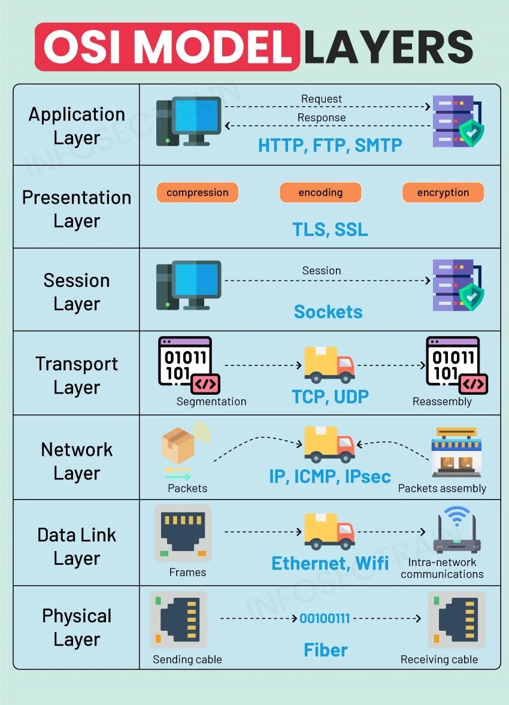
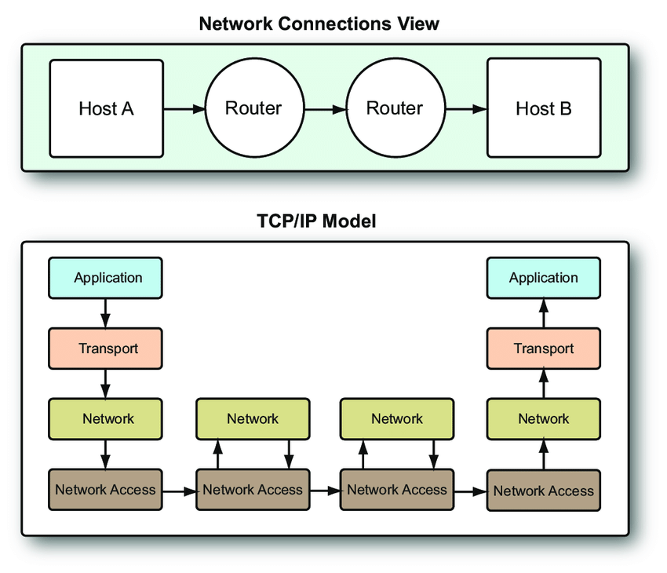
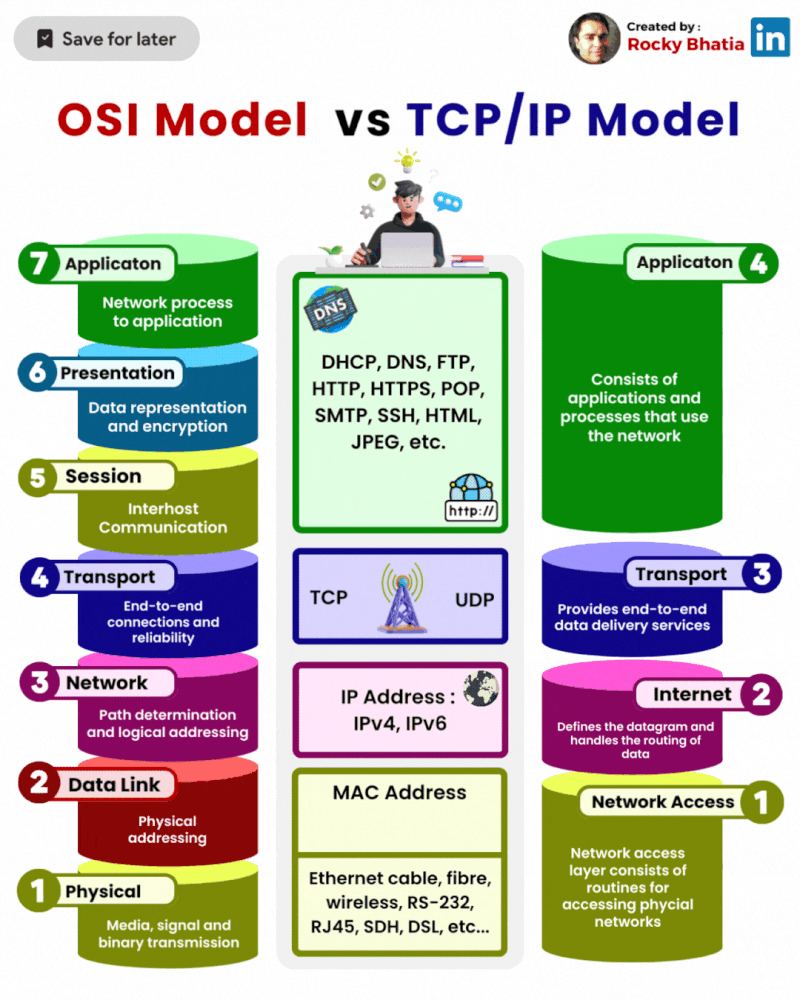
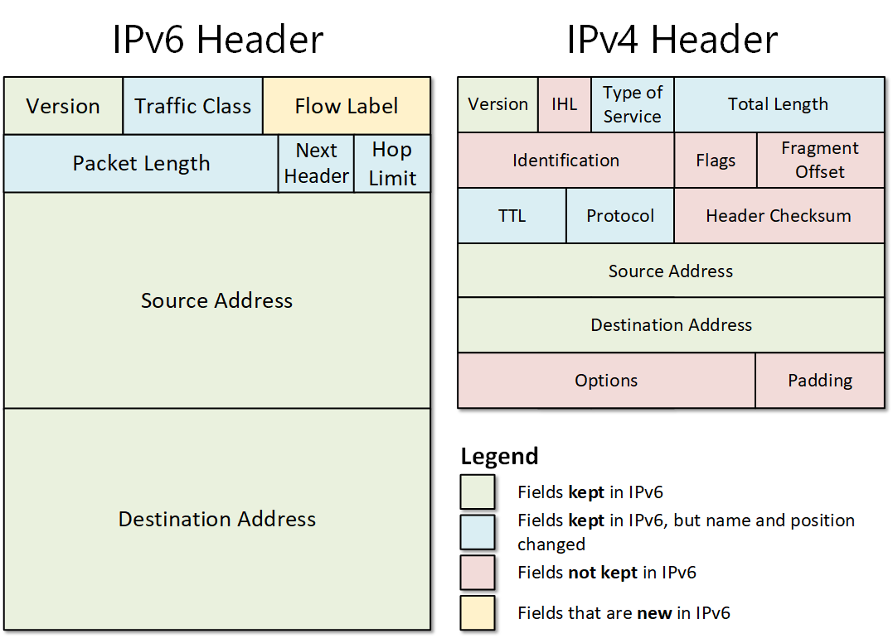
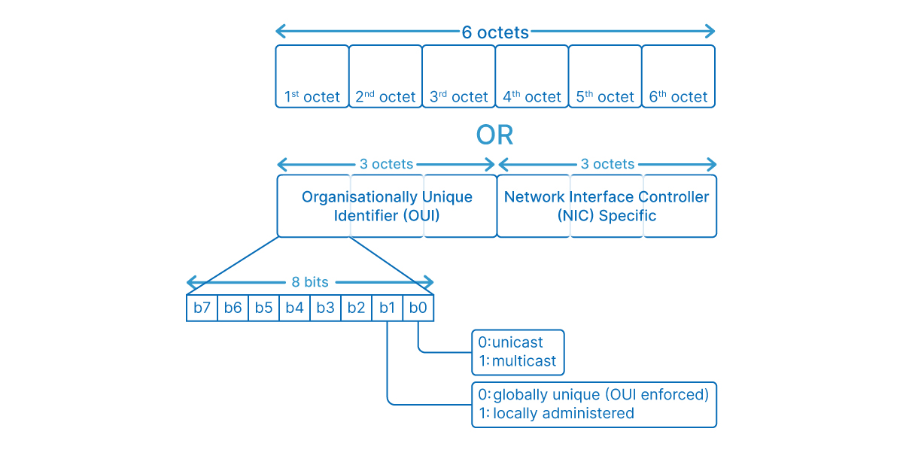
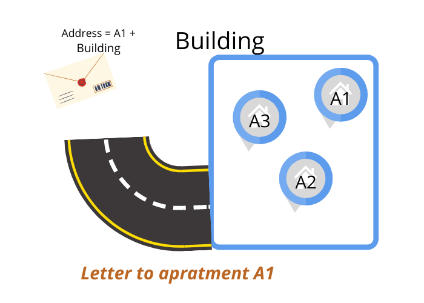

# Networking Fundamentals

## OSI & TCP/IP models

These models provide frameworks for understanding how data communication happens across networks. They break down the complex process into layers, each with specific functions.

### a) OSI (Open Systems Interconnection) Model

*   **Purpose:** A conceptual, vendor-neutral model developed by ISO to standardize network communication. It provides a detailed, 7-layer framework often used for teaching and troubleshooting.

<table>
  <tr>
    <td width="50%" valign="top">

*   **Layers:**

    1.  **Layer 7: Application:**
        *   **Function:** Provides network services directly to end-user applications. Interface between the network and the application software.
        *   **Examples:** HTTP, FTP, SMTP, DNS, Telnet. User interaction (e.g., web browser, email client).
        *   **Data Unit:** Data/Message.
    2.  **Layer 6: Presentation:**
        *   **Function:** Translates, formats, encrypts/decrypts, and compresses data. Ensures data is in a usable format for the Application layer.
        *   **Examples:** Data conversion (ASCII to EBCDIC), SSL/TLS encryption/decryption, JPEG, MPEG.
        *   **Data Unit:** Data/Message.
    3.  **Layer 5: Session:**
        *   **Function:** Establishes, manages, and terminates communication sessions between applications. Handles dialogue control and synchronization.
        *   **Examples:** NetBIOS, RPC (Remote Procedure Call), establishing/closing connections.
        *   **Data Unit:** Data/Message.
    4.  **Layer 4: Transport:**
        *   **Function:** Provides reliable or unreliable end-to-end data delivery between hosts. Handles segmentation, flow control, and error correction.
        *   **Protocols:** TCP (reliable, connection-oriented), UDP (unreliable, connectionless).
        *   **Key Concept:** Ports are used here to differentiate applications.
        *   **Data Unit:** Segment (TCP) / Datagram (UDP).
    5.  **Layer 3: Network:**
        *   **Function:** Responsible for logical addressing (IP addresses) and routing packets across different networks. Determines the best path for data.
        *   **Protocols:** IP (IPv4, IPv6), ICMP, OSPF, BGP.
        *   **Devices:** Routers operate at this layer.
        *   **Data Unit:** Packet.
    6.  **Layer 2: Data Link:**
        *   **Function:** Provides reliable data transfer across a *single physical link*. Handles physical addressing (MAC addresses), framing, error detection (not correction usually), and flow control on the local network segment.
        *   **Sublayers:** LLC (Logical Link Control) and MAC (Media Access Control).
        *   **Protocols:** Ethernet, Wi-Fi (802.11), PPP.
        *   **Devices:** Switches, Bridges, Network Interface Cards (NICs) operate here.
        *   **Data Unit:** Frame.
    7.  **Layer 1: Physical:**
        *   **Function:** Defines the physical characteristics of the network: transmission medium, voltage levels, data rates, physical connectors, etc. Transmits raw bits over the medium.
        *   **Examples:** Ethernet cables (Cat5e, Cat6), Fiber optic cables, Hubs, Repeaters, NICs (physical aspects).
        *   **Data Unit:** Bit.
    </td>
    <td width="50%" valign="top">

      
       
      *The 7 layers of the OSI reference model.*

    </td>
  </tr>
</table>

*   **Data Flow (Encapsulation/Decapsulation):** When sending data, it moves down the layers (Application to Physical), and each layer adds its own header (encapsulation). When receiving data, it moves up the layers (Physical to Application), and each layer removes its corresponding header (decapsulation).

### b) TCP/IP (Transmission Control Protocol/Internet Protocol) Model

*   **Purpose:** A more practical, widely implemented model that forms the basis of the modern internet. It's generally described with 4 or 5 layers.

<table>
  <tr>
    <td width="50%" valign="top">

     
*   **Layers (Common 4-Layer Version):**

    1.  **Application Layer:**
        *   **Function:** Combines the functions of OSI's Application, Presentation, and Session layers. Provides application-level protocols.
        *   **Protocols:** HTTP, HTTPS, FTP, SSH, DNS, SMTP, POP3, IMAP.
        *   **OSI Equiv:** Layers 7, 6, 5.
    2.  **Transport Layer:**
        *   **Function:** Same as OSI's Transport Layer. End-to-end communication using TCP or UDP, port numbers.
        *   **Protocols:** TCP, UDP.
        *   **OSI Equiv:** Layer 4.
    3.  **Internet Layer:**
        *   **Function:** Same as OSI's Network Layer. Logical addressing (IP), routing packets across networks.
        *   **Protocols:** IP (IPv4, IPv6), ICMP, ARP (often considered Layer 2/3).
        *   **OSI Equiv:** Layer 3.
    4.  **Network Access Layer (or Link Layer):**
        *   **Function:** Combines the functions of OSI's Data Link and Physical layers. Handles physical transmission of data on the local network segment (MAC addresses, frames, bits).
        *   **Protocols:** Ethernet, Wi-Fi, PPP.
        *   **OSI Equiv:** Layers 2, 1.

    </td>
    <td width="50%" valign="top">

      
       
      *The 4 layers of the TCP/IP model.*

    </td>
  </tr>
</table>

*   **Comparison:** TCP/IP is less theoretical and maps more directly to the protocols used on the internet. OSI is more detailed and better for conceptual understanding and troubleshooting layer-specific issues.

## IP addresses, MAC addresses, subnetting

These are fundamental concepts for identifying and locating devices on networks.

### a) IP Addresses (Internet Protocol Addresses)

*   **Purpose:** A logical address assigned to a device's network interface. Used for routing data packets across different networks (Layer 3). Can be changed (statically or dynamically via DHCP).
*   **Types:**
    *   **IPv4:**
        *   **Format:** 32-bit number, usually written as four 8-bit numbers (octets) in dotted-decimal notation (e.g., `192.168.1.100`).
        *   **Address Space:** ~4.3 billion addresses (now largely exhausted).
        *   **Public vs. Private:**
            *   *Public IPs:* Globally unique, routable on the internet. Assigned by ISPs.
            *   *Private IPs:* Reserved ranges for use within private networks (LANs). Not routable on the internet. Requires Network Address Translation (NAT) to communicate with the internet.
                *   `10.0.0.0` to `10.255.255.255` (/8)
                *   `172.16.0.0` to `172.31.255.255` (/12)
                *   `192.168.0.0` to `192.168.255.255` (/16)
        *   **Special Addresses:** Loopback (`127.0.0.1`), Network ID (e.g., `192.168.1.0`), Broadcast Address (e.g., `192.168.1.255`).
    *   **IPv6:**
        *   **Purpose:** Developed to overcome IPv4 address exhaustion.
        *   **Format:** 128-bit number, written as eight groups of four hexadecimal digits, separated by colons (e.g., `2001:0db8:85a3:0000:0000:8a2e:0370:7334`).
        *   **Address Space:** Vastly larger (2^128 addresses).
        *   **Features:** Simplified header, built-in security (IPsec often mandated), no NAT needed (generally), stateless autoconfiguration.
        *   **Shortening Rules:** Leading zeros in a group can be omitted (e.g., `:0db8:` becomes `:db8:`). Consecutive groups of all zeros can be replaced once with `::` (e.g., `2001:0db8:0000:0000:1234::` ).

### b) MAC Addresses (Media Access Control Addresses)

*   **Purpose:** A physical or hardware address uniquely identifying a Network Interface Card (NIC). Used for communication *within* the same local network segment (Layer 2). Cannot be easily changed (burned into the hardware, though spoofing is possible).
*   **Format:** 48-bit number, usually written as six groups of two hexadecimal digits, separated by colons (`:`) or hyphens (`-`) (e.g., `00:1A:2B:3C:4D:5E` or `00-1A-2B-3C-4D-5E`).
*   **Structure:**
    *   First 3 bytes (24 bits): Organizationally Unique Identifier (OUI), assigned to the manufacturer.
    *   Last 3 bytes (24 bits): Assigned by the manufacturer to be unique for that OUI.
*   **ARP (Address Resolution Protocol):** Used on IPv4 networks to map a known IP address to its corresponding MAC address on the local network. A device broadcasts an ARP request ("Who has IP address X?"), and the device with that IP replies with its MAC address.

### c) Subnetting

*   **Purpose:** The process of dividing a larger IP network into smaller, logical subnetworks (subnets).
*   **Benefits:**
    *   **Organization:** Groups related devices logically.
    *   **Efficiency:** More efficient use of IP address space compared to old classful addressing.
    *   **Performance:** Reduces broadcast traffic (broadcasts are contained within a subnet).
    *   **Security:** Can isolate networks and apply specific security policies per subnet.
*   **How it Works:**
    *   **Subnet Mask:** A 32-bit number (for IPv4) that defines which part of an IP address represents the network (and subnet) and which part represents the host. It "masks" the network portion.
        *   Written in dotted-decimal (e.g., `255.255.255.0`) or CIDR notation.
        *   Binary `1`s correspond to the network/subnet portion, `0`s correspond to the host portion.
    *   **CIDR (Classless Inter-Domain Routing):** The modern standard. Uses a slash (`/`) followed by the number of bits in the network portion of the address (e.g., `192.168.1.0/24`).
        *   `/24` means the first 24 bits are the network portion (equivalent to `255.255.255.0`).
        *   `/16` means the first 16 bits are the network portion (equivalent to `255.255.0.0`).
        *   `/27` means the first 27 bits are the network/subnet portion (equivalent to `255.255.255.224`).
    *   **Borrowing Bits:** Subnetting involves "borrowing" bits from the host portion of the address to create subnet identifiers. Each borrowed bit doubles the number of possible subnets and halves the number of hosts per subnet.
*   **Example:**
    *   Network: `192.168.1.0/24` (Network ID: `192.168.1`, Host range: `.1` to `.254`, Broadcast: `.255`)
    *   Subnetting into `/25`: Borrow 1 bit.
        *   Mask: `255.255.255.128` (`/25`)
        *   Subnet 1: `192.168.1.0/25` (Hosts: `.1` to `.126`, Broadcast: `.127`)
        *   Subnet 2: `192.168.1.128/25` (Hosts: `.129` to `.254`, Broadcast: `.255`)

**Details: [Follow link for details](subnetting.md)**

## Ports & Protocols (HTTP, HTTPS, FTP, SSH, DNS, etc.)

While IP addresses get data to the right computer, ports and protocols ensure the data gets to the right application on that computer and is understood correctly.

### a) Ports

*   **Purpose:** Logical endpoints within a host operating system, identified by numbers. Used by the Transport Layer (TCP/UDP) to differentiate between multiple applications or services running on the same device.
*   **Analogy:** If the IP address is the street address of an apartment building, the port number is the specific apartment number.
*   **Range:** 16-bit numbers (0 to 65535).
*   **Categories:**
    *   **Well-Known Ports (0-1023):** Assigned by IANA for standard, system-level services. (e.g., HTTP: 80, HTTPS: 443, FTP: 20/21, SSH: 22, DNS: 53). Require administrative privileges to bind to on most OSes.
    *   **Registered Ports (1024-49151):** Assigned by IANA for specific applications or services registered by vendors. (e.g., MySQL: 3306, RDP: 3389).
    *   **Dynamic/Private/Ephemeral Ports (49152-65535):** Used by client applications as source ports when initiating connections. Assigned dynamically by the OS.

A port number in a computer network is similar to an apartment number, while an IP address is similar to a postal address of the building. When a real letter needs to reach an apartment, it must first arrive at the building before reaching the apartment.

### b) Protocols

*   **Purpose:** Sets of rules and conventions that govern how data is formatted, transmitted, received, and interpreted between network devices. Protocols exist at various layers of the networking models.
*   **Common Application Layer Protocols (and their default ports/transport):**

    *   **HTTP (Hypertext Transfer Protocol):**
        *   **Use:** Foundation of data communication for the World Wide Web (fetching web pages, images, etc.).
        *   **Port:** TCP 80
        *   **Transport:** TCP
        *   **Key Feature:** Stateless request-response protocol. Transmits data in plain text.
    *   **HTTPS (Hypertext Transfer Protocol Secure):**
        *   **Use:** Secure version of HTTP. Used for secure web communication (online banking, e-commerce).
        *   **Port:** TCP 443
        *   **Transport:** TCP
        *   **Key Feature:** Uses SSL/TLS (Secure Sockets Layer/Transport Layer Security) to encrypt the communication between client and server, providing confidentiality and integrity.
    *   **FTP (File Transfer Protocol):**
        *   **Use:** Transferring files between a client and a server.
        *   **Ports:** TCP 20 (Data connection), TCP 21 (Control connection)
        *   **Transport:** TCP
        *   **Key Feature:** Uses separate connections for control commands and data transfer. Transmits credentials in plain text (use SFTP or FTPS for security).
    *   **SSH (Secure Shell):**
        *   **Use:** Provides secure remote login, command execution, and other secure network services (like tunneling) over an insecure network.
        *   **Port:** TCP 22
        *   **Transport:** TCP
        *   **Key Feature:** Encrypts the entire session, replacing insecure protocols like Telnet and rlogin. Also used for SFTP (SSH File Transfer Protocol) and SCP (Secure Copy).
    *   **DNS (Domain Name System):**
        *   **Use:** Translates human-readable domain names (e.g., `www.google.com`) into machine-readable IP addresses (e.g., `172.217.160.142`).
        *   **Port:** UDP 53 (for most queries), TCP 53 (for large queries or zone transfers)
        *   **Transport:** Primarily UDP (fast, low overhead), fallback to TCP if needed.
        *   **Key Feature:** Hierarchical distributed database system essential for internet navigation.

| Protocol        | Port(s) | Description                                                                |
|-----------------|---------|----------------------------------------------------------------------------|
| HTTP            | 80      | Hypertext Transfer Protocol - Used for web browsing.                       |
| HTTPS           | 443     | HTTP Secure - Encrypted communication for secure web browsing.             |
| FTP             | 20, 21  | File Transfer Protocol - Used for transferring files between computers.    |
| SSH             | 22      | Secure Shell - Securely connects to remote systems for command-line access. |
| Telnet          | 23      | Telnet - Unsecured remote command-line access (generally not recommended). |
| SMTP            | 25      | Simple Mail Transfer Protocol - Used for sending email.                   |
| POP3            | 110     | Post Office Protocol version 3 - Used for retrieving email from a server.  |
| IMAP            | 143     | Internet Message Access Protocol - Used for managing and retrieving email.  |
| DNS             | 53      | Domain Name System - Translates domain names to IP addresses.             |
| DHCP            | 67, 68  | Dynamic Host Configuration Protocol - Assigns IP addresses and network info. |
| SNMP            | 161, 162| Simple Network Management Protocol - Used for managing network devices.     |
| LDAP            | 389     | Lightweight Directory Access Protocol - Used for directory services.        |
| SMB/CIFS        | 139, 445| Server Message Block/Common Internet File System - For file and printer sharing on local networks. |
| RDP             | 3389    | Remote Desktop Protocol - Allows graphical remote access to Windows systems. |
| MySQL           | 3306    | MySQL Database - Default port for MySQL database server.                  |
| PostgreSQL      | 5432    | PostgreSQL Database - Default port for PostgreSQL database server.         |
| SIP             | 5060, 5061| Session Initiation Protocol - Used for VoIP (Voice over IP) signaling.   |
| RTP/RTCP        | (varies) | Real-time Transport Protocol/RTP Control Protocol - Used for streaming media like audio and video. |
