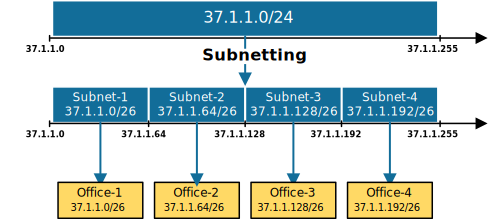

# **What is Subnetting?**

	

This lesson explains what IP subnetting is through a visual example. Suppose a company has a block of 256 public IP addresses provided by the local service provider. 

 
*Figure 1: Company's block of 256 addresss*

The IP address block is 37.1.1.0 255.255.255.0, written in slash notation as 37.1.1.0/24. Using the technique shown in our previous lesson, we can easily calculate that the boundaries of this network are Network ID 37.1.1.0 and Broadcast address 37.1.1.255, as shown in figure 1 above.

The company has four offices with 50 users each. As a network engineer, you are tasked to divide the company's public IP address block 37.1.1.0/24 into four subnets with at least 50 usable IP addresses and assign a subnet to each office. Figure 2 illustrates the requirements.

 
*Figure 2: Subnetting based on the number of hosts - Example 1Figure 2\. Subnetting based on the number of hosts \- Example 1*

If we do not subnet the 37.1.1.0/24 address block into multiple smaller blocks, we can only use it in one office. For example, we can assign the entire 37.1.1.0/24 to office 1\. However, the company will then need to buy additional IP address blocks for the other offices. (the company's management won't be happy about that). 

Here is the point where IP subnetting comes into the picture.

## **What is Subnetting?**

IP subnetting is the process of dividing a single IP network into smaller sub-networks called subnets, as illustrated in figure 3 below. It's an important aspect of network management and is commonly used by administrators to optimize their IP address usage.

Figure 3 illustrates the purpose of IP subnetting \- we divide a network into smaller subnets so that we can use the IP address space more efficiently, which is crucial given the limited number of available IPv4 addresses. For example, instead of assigning the entire 37.1.1.0/24 to office-1 and telling the management to buy more addresses, we divide the network 37.1.1.0/24 into four smaller subnets and assign a subnet to each office.

*Figure 3: What is Subnetting?*

That's, in short, what subnetting is and why we need it. Now let's see how we do it.

## **The subnetting process**

First, let's emphasize the basics \- an IP address has two main components: the network and host portions. The network portion identifies the network, while the host portion identifies a host within that network. The subnet mask determines the boundary between the network and host portion. We showed this in our previous lesson about the subnet mask.

In this lesson's example, we have the network 37.1.1.0/24. Therefore, the mask is 24 bits long, which means that the first 24 bits of the IP address 37.1.1.0 identify the network, as shown in figure 4 below. The last 8 bits identify the host portion. When doing subnetting, we work with the host portion of the original network given to us. We do not touch the original network portion.

To divide the network into subnets, **we convert some of the leftmost host bits into network bits**. We call these bits \- subnet bits. When doing this, we create multiple sub-networks smaller than the original network. The question is \- how do we decide how many host bits to convert to subnet bits? 

Here is how we calculate the number of subnets created and the number of hosts per subnet.

2^subnet bits \= number of subnets created  
2^host bits \- 2 \= number of hosts per subnet

For example, with a single subnet bit, we can create 21 or 2 subnets. With 2 bits, 22 or 4 subnets, with 3 bits, 23 or 8 subnets, and so forth. The number of subnet bits must be sufficient to create as many sub-networks as required. At the same time, the remaining host bits must also be sufficient to ensure that we have as host IP addresses as needed.

Figure 4 below illustrates the subnetting process.

*Figure 4: The Subnetting Process*

Now let's see an example.

## **Subnetting example**

The first thing we need to do is to decide how many hosts per subnet we need. In our example, we need sub-networks with at least 50 usable addresses. To calculate the required host bits, we find the smallest power of 2 equal to or greater than the number of required hosts plus two (for the network and broadcast addresses). In this case, 50 \+ 2 \= 52\. The smallest power of 2 equal to or greater than 52 is 26 (64).

Ok, so we have 8 original host bits. For subnets with at least 50 usable host addresses, we need 6 host bits. Therefore, we are left with 2 bits that we can convert to subnet bits.

To calculate the new subnet mask of the sub-networks, we add the subnet bits to the original mask \- 24+2 \= /26. Figure 5 illustrates this example.

*Figure 5: Subnetting Example*

Now, to calculate the boundaries of each subnet, we convert the binary representation to decimal. For example, the first subnet's Network ID is 00100101.0000001.00000001.00000000 (37.1.1.0), and the Broadcast address is 00100101.0000001.00000001.00111111 (37.1.1.63). Notice that the network bits are in blue and the host bits are in red. The network bits are 26 \- the 24 original network bits plus the 2 subnet bits. Therefore, for Subnet 1:

* Network Address: 37.1.1.0/26  
* Usable IP Range: 37.1.1.1 \- 37.1.1.62  
* Broadcast Address: 37.1.1.63

Subnet 2's Network ID is 00100101.0000001.00000001.01000000 (37.1.1.64), and the Broadcast address is 00100101.0000001.00000001.01111111 (37.1.1.127):

* Network Address: 37.1.1.64/26  
* Usable IP Range: 37.1.1.65 \- 37.1.1.126  
* Broadcast Address: 37.1.1.127

Subnet 3's Network ID is 00100101.0000001.00000001.10000000 (37.1.1.0), and the Broadcast address is 00100101.0000001.00000001.10111111 (37.1.1.63):

* Network Address: 37.1.1.128/26  
* Usable IP Range: 37.1.1.129 \- 37.1.1.190  
* Broadcast Address: 37.1.1.191

Subnet 4's Network ID is 00100101.0000001.00000001.11000000 (37.1.1.0), and the Broadcast address is 00100101.0000001.00000001.11111111 (37.1.1.63):

* Network Address: 37.1.1.192/26  
* Usable IP Range: 37.1.1.193 \- 37.1.1.254  
* Broadcast Address: 37.1.1.255

Now we can assign each of the four /26 subnets to the four offices, providing enough IP addresses for 50 users per office, as shown in figure 6 below.

*Figure 6: Assigning an IP network to each office*

With that, our first example is done. If you are encountering IP subnetting for the first time, it probably seems a little confusing. However, when we do a couple of more examples, it will most likely click and become clear.

source: https://www.networkacademy.io/ccna/ip-subnetting/what-is-subnetting