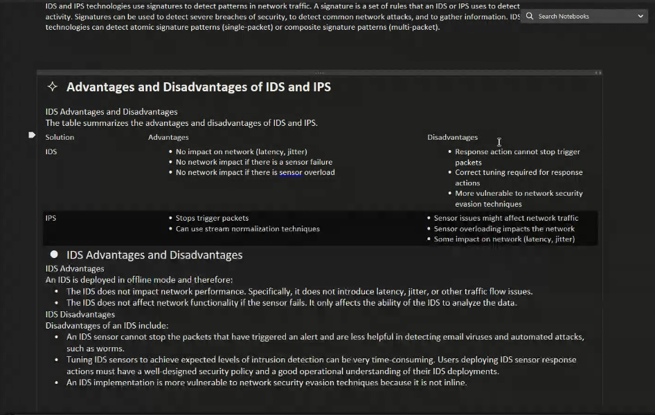
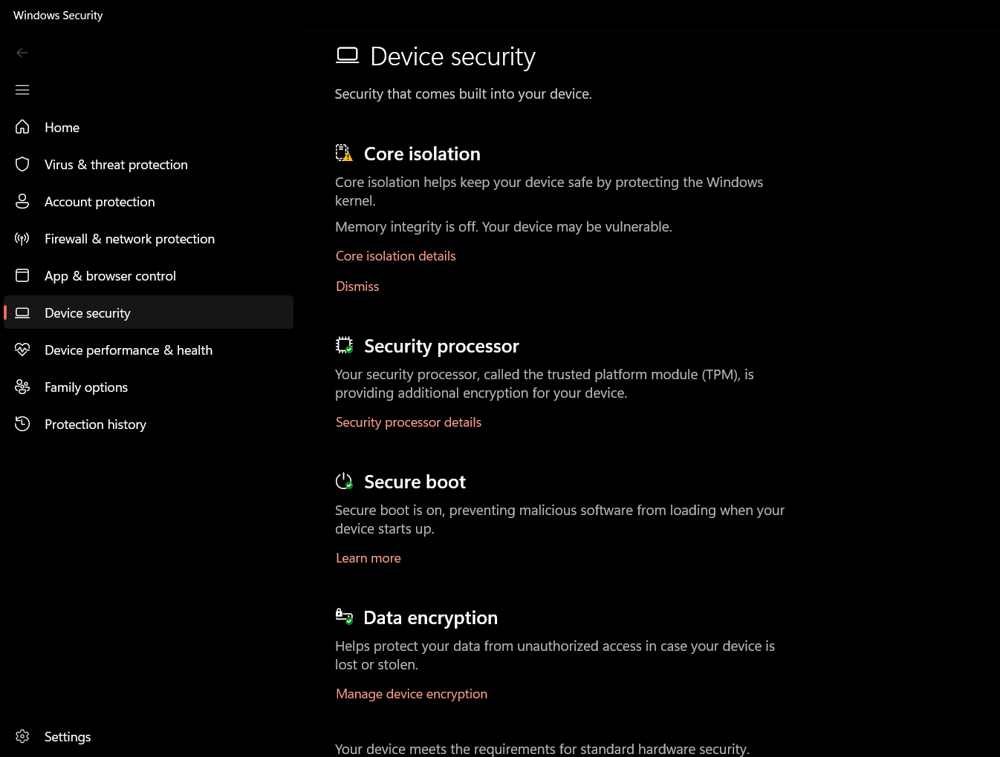

dns checker online tool
privacy and anonymity -- change ip -- check ip from dns checker --> if traced back then not annonymus
POD - Point of a Delevery -- terminals(end device)
ZPE - Zone Privacy 
ACL - access control list 

SOC - 
SOAR -
A Security Operations Center (SOC) is a team or department within an organization that manages and monitors cybersecurity risks, while Security Orchestration, Automation, and Response (SOAR) is a technology that streamlines and automates security operations, often within the SOC, to improve response times and reduce manual effort. Essentially, the SOC is the people and the SOAR is the technology that helps them work more efficiently

tools for lab and can be used as well
SOPHOS - firewall 
PaloAlto -- firewall 

Win 11 depns on TPM to protect hhost from attach through virtual machine. setting is found under device curity 

ncpa.cpl -- for netwrork configuration

opendns.com --- allows to set rules on dns server to control traffic