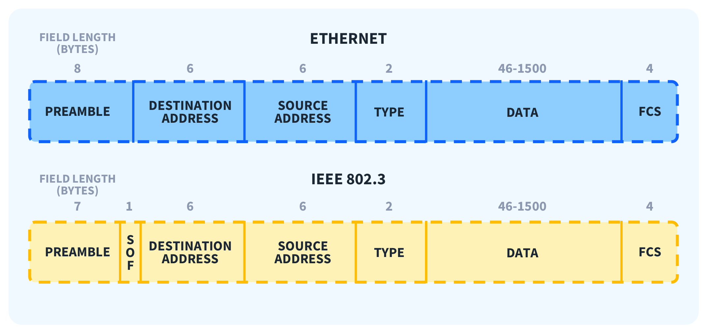

arp - address resolution Protocol
arp command is also avaolable 

getmac -- get the list of mac address in windows 
for linux 
    ip addr show
    ip a

ping change packet size and compare it with ethernet packet 

if packet size exceeds data size then ping will not work

[Reverse engineering - john mohammad ](https://www.youtube.com/@_JohnHammond)

solarwind SIM for network monitor https://hco.demo.solarwinds.com/s

vmware download and install page - https://knowledge.broadcom.com/external/article/368667/download-and-license-information-for-vmw.html

