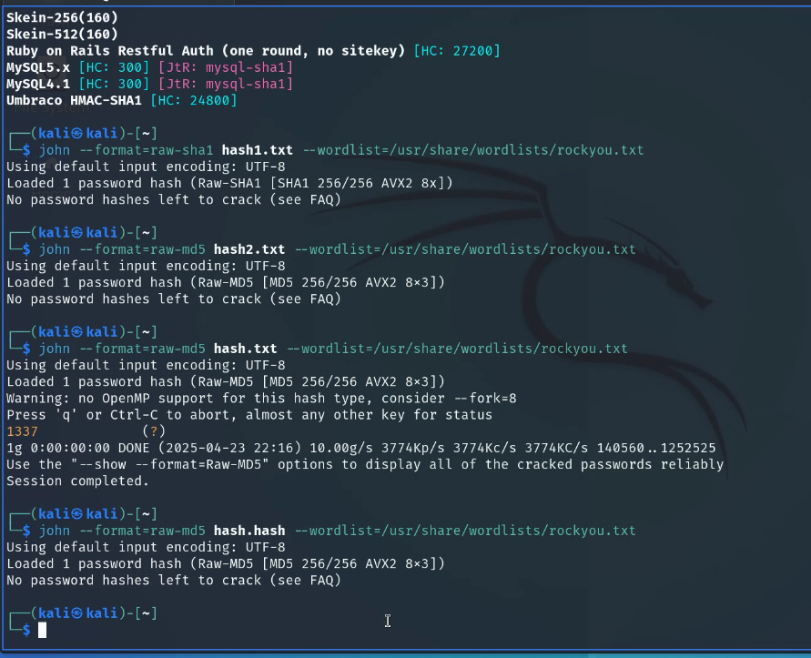

update commands 


uname -r
uname -a

apt search kali-linux    ---> (it shows which needs to be upgraded)
apt update -y
apt install kali
dpkg -l kali-linux-firmware 
apt list --upgradab
cat /etc/apt/sources.list


commands 
1. pwd
2. cd
   ~ = home 
   - = back button, takes bact to previous directory
3. ls
4. sudo su  --> exit superuser  --> exit
5. cat /etc/shells
6. echo $shell
7. whoami
8. man  --> manual 
9. pinfo/info  --> print info
10. --help option 
11. cat abc.txt | wc -l  --> word cound 
12. touch 
13. typenull --- to create file in windows 
14. type  --- windows 
15. systeminfo --- windows 
16. xset led off
17. uptime
18. w - Show who is logged on and what they are doing.
19. date
20. timedatectl
21. list-timezone
22. cal/calandar/ncalandar
23. hwclock


24. cat /proc/version
25. cat /proc/cpuinfo
26. cat /proc/meminfo
27. cat /proc/diskstats
free
fdisk
history
grep 
df
echo
top
ps

echo $HISTSIZE
du -sh ~/.zsh_history
!!
!<history number>
ping 
curl

head
tail

id
init 
echo $USER
echo $HOME


permissions notaions 
c -- character
d -- directoty
l -- links 
r -- read 
w -- write
x -- execute

man hier  -- search with /


nmap
mandb
documentaion files file://usr/share/doc

hailhait



categories 

update related 
file related
system info related 
services/daemons 
date time 
disk 
network 
user management 


Ethical hacling tool 

maltego 


hash identifier 
hashcat 
first brute force 
```hashcat -a 3 -m 0 e48e13207341b6bffb7fb1622282247b ?d?d?d?d ```
then 
```hashcat -a 3 -m 0 e48e13207341b6bffb7fb1622282247b %d%d%d%d --show```

once hash is cracked we cant brute force but hash is recorded in system so we can see the cracked value using --show option


rules 
john command 

identify 
hash-identifier cc03e747a6afbbcbf8be7668acfebee5

haiti <hash>

dictionar attack force
john --format=raw-md5 test.txt --wordlist=/usr/share/wordlists/rockyou.txt


GDPR --- https://gdpr-info.eu/

GDPR Information
https://gdpr-info.eu/

ISO Standards
https://en.wikipedia.org/wiki/List_of_ISO_standards
https://www.iso.org/standard/27001

PCI DSS Certification
https://www.imperva.com/learn/data-security/pci-dss-certification/

Cybersecurity Frameworks & Tools
https://www.nist.gov/cyberframework
https://attack.mitre.org/

ASCII Drawing Tool
https://www.asciiart.eu/ascii-draw-studio/app

Fancy Text / Carty Generator
https://fsymbols.com/generators/carty/
